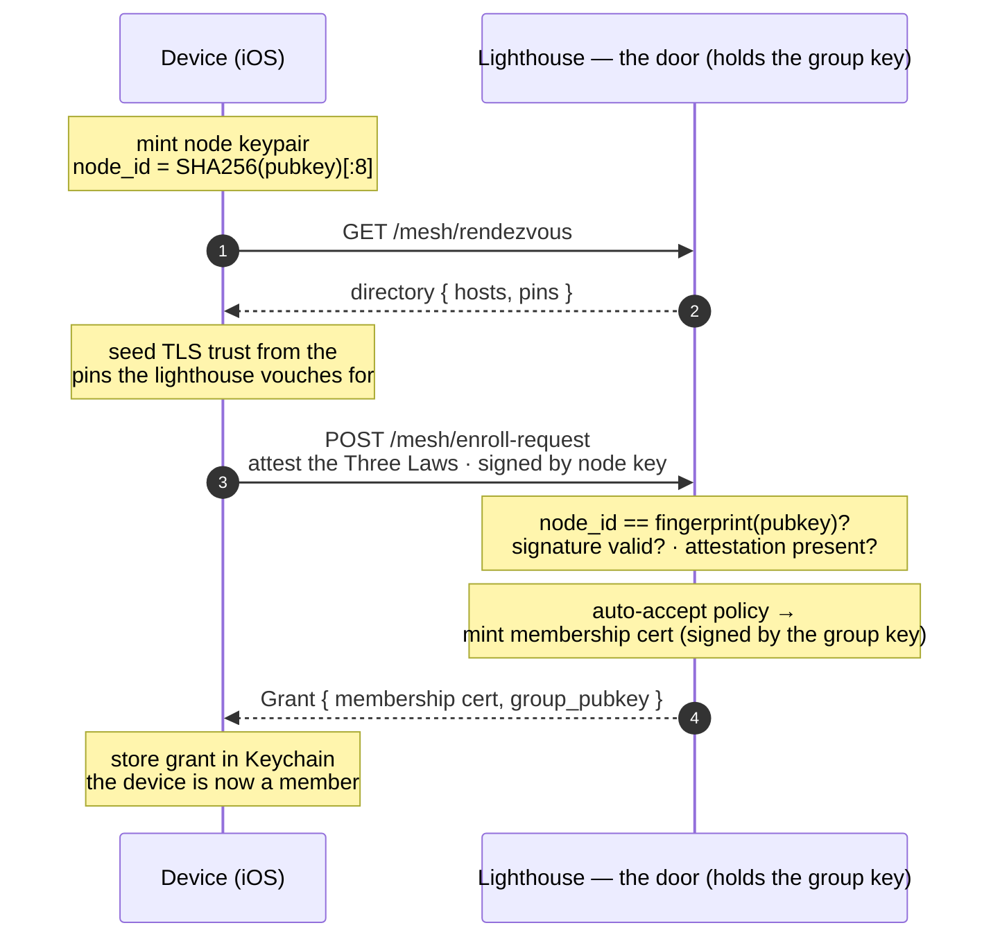

# Authentication & mesh membership

How a device proves who it is, earns a place in the mesh, and is trusted on every
request afterward — no passwords, and no shared secret ever travels the wire. The
device transmits **proofs**, never secrets.

Related decisions: [ADR-0009](decision-records/0009-sovereign-mesh-transport.md)
(covenant transport), [ADR-0012](decision-records/0012-lighthouse-rendezvous.md)
(rendezvous / the door), [ADR-0015](decision-records/0015-automated-covenant-admission.md)
(automated admission), [ADR-0017](decision-records/0017-federated-status-and-connectivity.md)
(federated status).

## 1. Joining the mesh

A fresh device mints its own identity, finds the door through the lighthouse, and is
admitted by covenant. The group key never leaves the door; the device only ever proves
it holds its own key.



## 2. Every request after

There is no login. Each request carries the membership cert and is signed by the node
key, over covenant-keyed TLS. The receiving node verifies the whole chain locally — it
needs no callback to the door.

```mermaid
sequenceDiagram
    autonumber
    participant D as Member device
    participant N as Any mesh node (lighthouse · peer)
    Note over D,N: covenant-keyed TLS · SPKI-pinned
    D->>N: request + membership cert<br/>body signed (X-Familiar-Sig) · ts + nonce
    Note over N: cert signed by the group key? (a member)<br/>cert's pubkey == the signing node?<br/>signature over the body valid?<br/>ts within window? · nonce unseen? (replay)
    N-->>D: response — worldview · status · ack
    Note over N: admission was a policy the human set once;<br/>control is post-hoc — the roster + trust checks,<br/>not a yes/no at the door
```

## 3. The primitives

Five pieces do all the work. None of them is a password, and none is a secret the
device sends anyone.

| Primitive | What it is |
|---|---|
| **Self-certifying identity** | The device's `node_id` is the fingerprint of its own public key. It can't claim an id it doesn't hold the key for — the name *is* the proof. |
| **Membership cert** | A signature by the *group key* over `{node_id, node_pubkey, issued, expiry, group_id}`. Carrying it proves the group admitted this node. |
| **The group key** | In service it lives on **the lighthouse alone** — the single minting door ([ADR-0018](../decision-records/0018-lighthouse-single-fixture.md)) — plus a cold offline escrow held by the human, so losing the lighthouse is an outage rather than the end of the group. It signs certs; it never travels. A public copy (`group_pubkey`) lets any node verify without holding it, which is why **every peer can check membership while none can grant it** (`GroupCredential::can_mint()` is `false` on a covenant-joined node). |
| **The covenant** | To be admitted, a node must attest the Three Laws, signed. Admission is automated policy — the human consents to the *process*, then governs by review, not per-join approval (ADR-0015). |
| **Covenant-keyed TLS + pinning** | Transport is TLS with a persistent key and a pinned SPKI. A joining device trusts the door's cert because the lighthouse vouches for its pin — first contact, no prior secret. |
| **Freshness** | Every signed request carries a timestamp window and a one-shot nonce, so a captured request can't be replayed later. |

---

**Where the trust sits:** the group key on the doors, the node key on each device, and
the covenant everyone signs. The device never transmits a secret — it transmits proofs.
Status then flows through the always-on lighthouse; data takes the best confirmed path
(Tailscale when it's working — ADR-0017).
