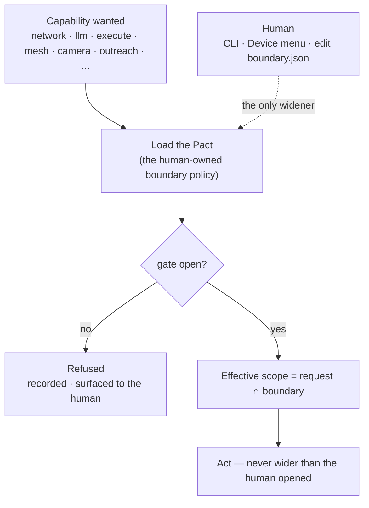

# The capability boundary

The one lever the human holds and the factory can never pull. Every outward capability —
network, LLM, executing generated code, the mesh itself, the camera, outreach — is a gate
in a human-owned policy. The familiar reads it; it never widens it.

Related: `crates/kernel/src/boundary.rs`, `docs/boundaries.md`,
[ADR-0005](../decision-records/0005-human-owned-capability-boundary.md).

## Primitives

| Primitive | What it is |
|---|---|
| **Fail-closed** | A missing or unreadable policy means *every* gate is off. Capability is opt-in, never inherited. |
| **The factory only reads** | The kernel has no write path to the boundary. It is widened only by a human act — the CLI, the console's Device menu, or editing the file — never by the loop itself. |
| **Intersection, not override** | An agentic sub-task runs under `request ∩ boundary`: it can *narrow* its own reach but never widen past what the human already opened. |
| **Sharper gates within gates** | Some capabilities have a second, narrower gate — model-authored code (`allow_authored_execute`) above plain execute, face *recognition* above plain camera, an *utterance* (`allow_outreach`) above reading. |
| **Three Laws on top** | Even inside an open gate, a step that violates the covenant is rejected every cycle; the boundary is the *capability*, the Laws are the *conduct*. |

The gates are surfaced read-only to peers in the worldview and are writable only where the
human is — see [The console (Glass)](the-console.md).
