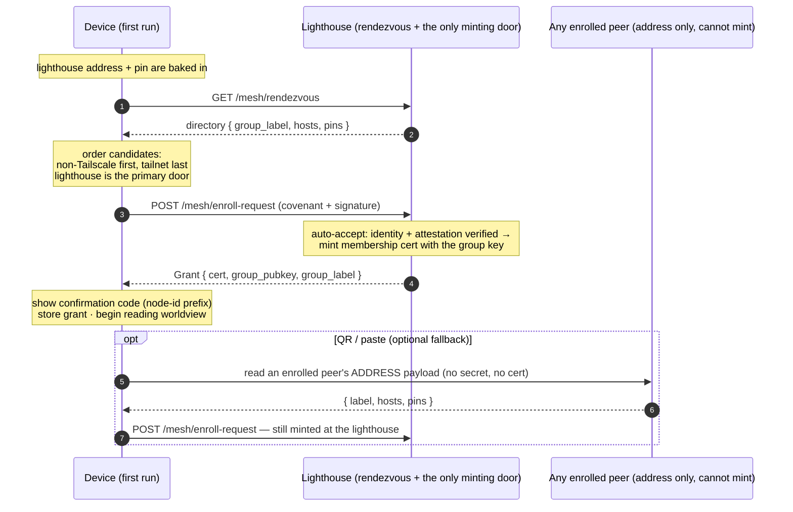

# Finding & joining a mesh

How a fresh device finds a mesh with no QR and no one standing next to it, and joins
by covenant. The lighthouse is the one always-on piece of infrastructure, so every
device starts there.

> **Being rebuilt** ([ADR-0026](../decision-records/0026-two-filter-admission.md)): the
> grant at the end of this page stops being full membership — it lands the device as a
> **guest**, and admission completes when the human identity is established by evidence.
> [Joining & the welcome](join-and-welcome.md) traces the new flow; this page remains
> accurate for discovery and the handshake mechanics.

Related: [ADR-0012](../decision-records/0012-lighthouse-rendezvous.md) (rendezvous /
the door), [ADR-0015](../decision-records/0015-automated-covenant-admission.md)
(automated admission). The identity + cert mechanics live in
[Authentication & mesh membership](auth-and-membership.md).

## Primitives

| Primitive | What it is |
|---|---|
| **Baked lighthouse** | The client ships knowing the lighthouse's address and pin, so a device with no prior contact can still reach the mesh and trust the door. |
| **Rendezvous directory** | Soft-state list the lighthouse hosts: which meshes exist, where their doors are, and which cert pins to trust. Labels + addresses only — no secret. |
| **The minting door** | **The lighthouse, and only the lighthouse** ([ADR-0018](../decision-records/0018-lighthouse-single-fixture.md)). It is the sole node holding the group secret in service, so it is the sole node that can admit. Every other node is a peer whose `can_mint()` is `false`. |
| **A peer's invite is an address** | An enrolled peer holds no group secret, so it cannot issue a membership — the QR/paste payload carries `{ label, hosts, pins }` and nothing more. The join it starts is still completed at the lighthouse. |
| **Confirmation code** | The first six of the node id, shown to the human — the same handle the steward would see, for after-the-fact recognition. |
| **QR / paste** | Still available as an optional path (an enrolled device presents its address), but no longer the front door. |

The candidate ordering matters: a **non-Tailscale path is established first** (a nearby peer
on-network, else the lighthouse); Tailscale is only preferred once it's confirmed working.
See [Status & connectivity](status-connectivity.md).
