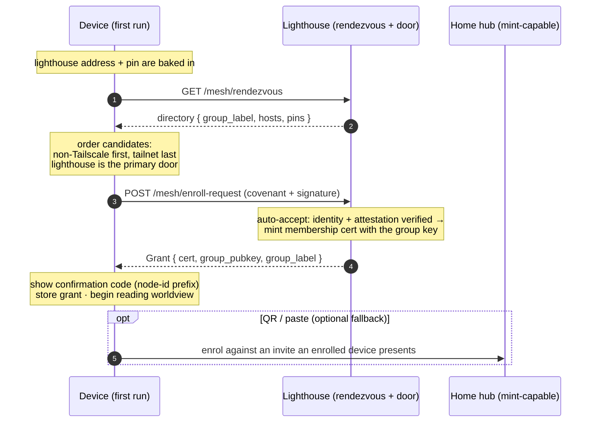

# Finding & joining a mesh

How a fresh device finds a mesh with no QR and no one standing next to it, and joins
by covenant. The lighthouse is the one always-on piece of infrastructure, so every
device starts there.

Related: [ADR-0012](../decision-records/0012-lighthouse-rendezvous.md) (rendezvous /
the door), [ADR-0015](../decision-records/0015-automated-covenant-admission.md)
(automated admission). The identity + cert mechanics live in
[Authentication & mesh membership](auth-and-membership.md).

## Primitives

| Primitive | What it is |
|---|---|
| **Baked lighthouse** | The client ships knowing the lighthouse's address and pin, so a device with no prior contact can still reach the mesh and trust the door. |
| **Rendezvous directory** | Soft-state list the lighthouse hosts: which meshes exist, where their doors are, and which cert pins to trust. Labels + addresses only — no secret. |
| **Mint-capable door** | Any node holding the group key can admit — the lighthouse and the home hub both can, so joining works whether or not the home hub is reachable. |
| **Confirmation code** | The first six of the node id, shown to the human — the same handle the steward would see, for after-the-fact recognition. |
| **QR / paste** | Still available as an optional path (an enrolled device presents an invite), but no longer the front door. |

The candidate ordering matters: a **non-Tailscale path is established first** (the home
hub on-network, else the lighthouse); Tailscale is only preferred once it's confirmed
working. See [Status & connectivity](status-connectivity.md).
