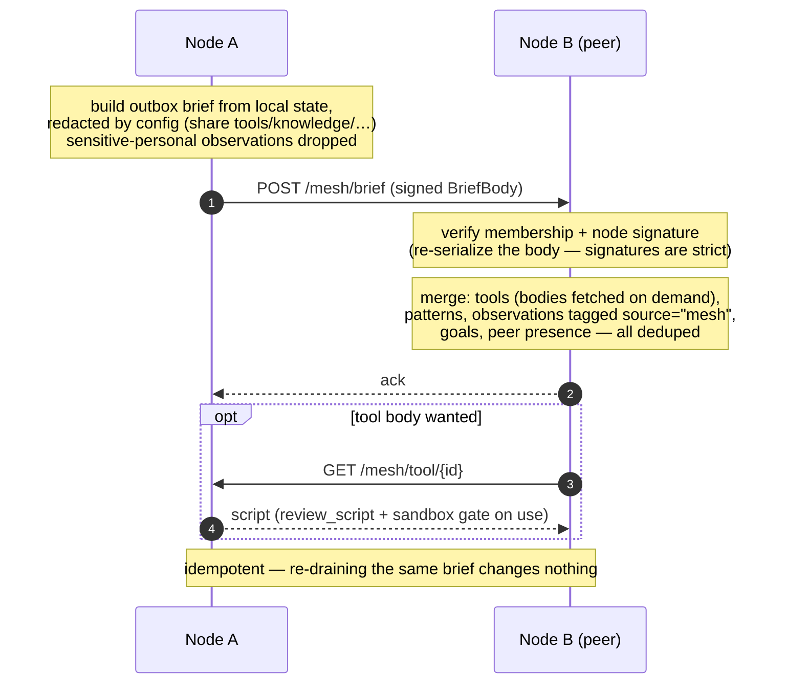

# Gossip & federation

How nodes share what they know — tools, distilled patterns, recent observations, goals,
peer presence — so the mesh converges on a wider, corroborated picture without any
central store. Every exchange is signed; peer data is tagged, never laundered into local
truth.

Related: [ADR-0009](../decision-records/0009-sovereign-mesh-transport.md) (the covenant
transport + brief), [Authentication & mesh membership](auth-and-membership.md).

## Primitives

| Primitive | What it is |
|---|---|
| **The brief** | A signed snapshot of what a node offers: capability, tool manifests, distilled patterns, a bounded window of recent observations, goals, and its own presence. |
| **Strict signatures** | Verification re-serializes the signed body, so a field an older peer doesn't know breaks every signature — new brief fields are added carefully, never casually (this is *why* status federates on its own channel, ADR-0017). |
| **Tagged, never laundered** | A peer's observations arrive as `source="mesh:<node>"` — usable as evidence, never mistaken for this node's own senses. |
| **Tools on demand** | Manifests travel in the brief; a tool *body* is fetched only when wanted, and still passes `review_script` + sandbox + the execute gate before it runs. |
| **Config-redacted** | What leaves is gated by `share_tools` / `share_knowledge` / `share_observations` / `share_identities`; identity only under explicit per-human, per-group opt-in; sensitive-personal never. |
| **Idempotent merge** | Deduped by a content key, so gossiping the same thing every round converges instead of piling up. |

Presence and connectivity are deliberately **not** in the brief — they ride the status
channel so they can update without a schema change; see
[Status & connectivity](status-connectivity.md).
