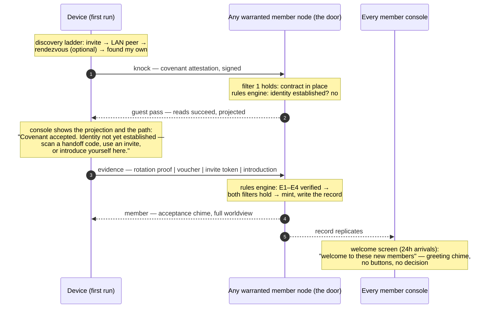

# Joining & the welcome — two filters, no gate

How a device goes from stranger to member under
[ADR-0026](../decision-records/0026-two-filter-admission.md): admission is **rules-based**,
automatic the moment two filters both hold — the **device contract** (a signed attestation of
the Three Laws) and an **established human identity** (evidence, not assertion). Until then the
device is a guest reading the [projection](../decision-records/0020-standing-and-the-guest-projection.md);
after, every console's welcome screen greets the arrival. Nobody approves anybody.

Related: [ADR-0025](../decision-records/0025-device-identity-is-not-key-identity.md) (key ≠
device ≠ person — the record this flow writes), [ADR-0019](../decision-records/0019-friendly-identification.md)
(the ladder an introduction runs on), [Finding & joining](finding-and-joining.md) (discovery,
which this page picks up from), [Authentication & mesh membership](auth-and-membership.md)
(the proof mechanics under every request).

## The two filters

| filter | satisfied by | machinery |
|---|---|---|
| **Device contract** | the covenant handshake at the knock: self-certifying identity, signed body, Three Laws attestation — retained in the record | the existing enrolment proof chain |
| **Identity established** | evidence, one of four classes (below) — never a bare claim | the rules engine, one pure function |

## The four evidence classes

| class | artifact | typical scenario |
|---|---|---|
| **E1 rotation proof** | new key's enrolment signed by the device's previous key | reinstall; device handoff |
| **E2 device voucher** | continuity signed by a device already bound to the claimed handle (handoff scan; phone→watch link) | old user, new device — no second person |
| **E3 invite token** | single-use, ten-minute, member-signed; may name the expected handle | invited newcomer, anywhere |
| **E4 local introduction** | introduce-yourself (name/face/voice) **with provenance**: a member-colocated network, an established device, or founding | walk-up newcomer; new human on a household device |

Guardrails: an E4 introduction can never claim an **existing** handle (that takes E1/E2/E3 —
typing "I am Betty" cannot become Betty), and a pure remote stranger satisfies no class — they
stay a guest, told plainly what is missing.

## The four scenarios

| scenario | contract | identity | what it feels like |
|---|---|---|---|
| new user / new device | at the knock | E3 or E4 (or founding) | guest console at once; introduce yourself; chime; every console greets you |
| old user / new device | at the knock | E1 handoff or E2 voucher | scan your old device; nobody else involved |
| new user / old device | long since | E4 on the established device | the device stays a member; the new human is the arrival |
| old user / old device | already | E1 on reinstall, or nothing | a non-event — history, not the welcome list |

## Primitives

| Primitive | What it is |
|---|---|
| **The knock** | The covenant handshake — `enroll-request` with the signed Three Laws attestation. Satisfies the contract filter mechanically; admits nothing by itself. |
| **The guest pass** | A guest's reads *succeed* and return the projection — the live mesh with the people taken out. A guest who never establishes stays one forever; that is the reviewer, the demo viewer, the visitor. |
| **The rules engine** | One pure function over (record, evidence): both filters hold → mint. The same rules run on every warranted door, so an admission is the same fact wherever it happened. |
| **The record** | One `MembershipRecord` per device — keys, state, identity claim vs. establishment, the signed `AdmissionFact`, corrections. Replicates everywhere; the only answer to any membership question. |
| **The welcome** | The third leg of [ADR-0021](../decision-records/0021-live-roster-and-the-record.md)'s split: *who is new*, last 24 hours, rendered as a greeting with how each identity was established. No buttons. |
| **Correction** | `sever` / `disestablish` / `hold` / `restore` — signed, traveling, cheap. Lives on the roster card and the CLI, never the welcome screen. Trust extended automatically must be cheap to withdraw deliberately. |
