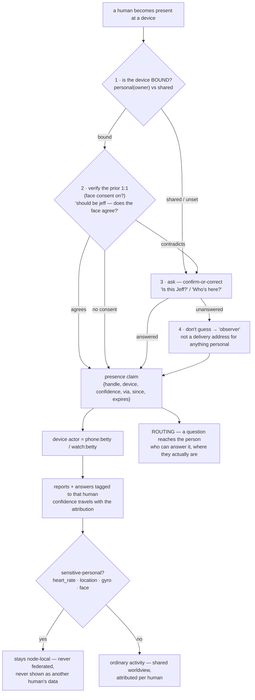

# Served identity & attribution

A node serves *many* humans, not one creator, and devices are shared and change hands.
So activity is attributed to whoever is actually present — never a baked "creator" — and
a shared worldview never becomes a shared body.

Related: [ADR-0016](../decision-records/0016-multi-human-served-identity.md),
[ADR-0019](../decision-records/0019-friendly-identification.md) (the ladder below),
`crates/kernel/src/identity.rs`.

Identification is a **ladder**, not a set of alternatives: the cheapest rung that applies
wins, and each lower rung runs only when the one above is unavailable or contradicted. A
personal phone usually settles it at rung 1 with no camera at all. The output is a
*presence claim* that carries a confidence and **expires** — so "Jeff is here" and "Jeff
was here an hour ago" stay distinguishable.

> **Identification addresses; it never authorises.** This is friendly identification, not
> authentication. Being recognised unlocks nothing — the sensitive-personal scoping below
> stays keyed to consent and node-locality, never to who the camera believes is present.
> See [ADR-0019](../decision-records/0019-friendly-identification.md).

## Primitives

| Primitive | What it is |
|---|---|
| **The identity registry** | An append-only record of everyone the familiar has come to know — handle, name, relation, interactions, and (strongly-gated) a face signature. Names are quality data; a known name is never discarded. |
| **Present, not baked** | The device actor's human suffix comes from `servedHuman`, established by face → manual pick → enrolled default. It defaults to `observer`, never a hard-coded person. |
| **Attribution by actor** | The whole system reads the actor suffix as the human, so a shared iPad's activity is tagged to the person using it — the roster shows who's present and how it was established. |
| **Sensitive-personal scoping** | Health / precise position / biometric are attributed locally but never leave the node; a face signature never federates under any sharing setting. |
| **One shared worldview** | The mesh is a shared worldview *with per-human attribution* — everyone's ordinary activity is visible, tagged by who; only the personal body is held back. |

The attribution rides through [Observation ingest](observation-ingest.md); the redaction
happens on the way out in [Gossip & federation](gossip-federation.md).
