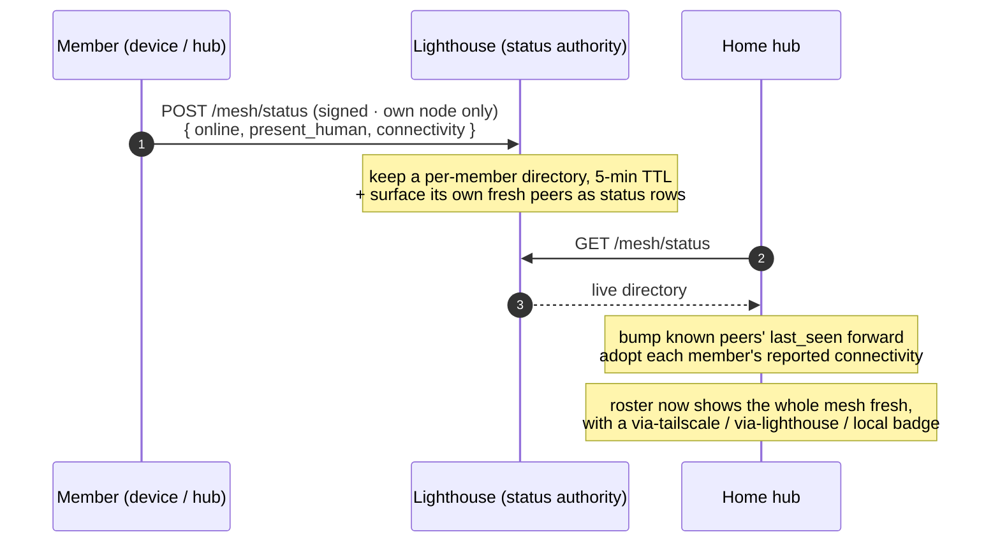

# Status & connectivity

How the mesh always knows who's online and how each member is connected — even for a
member no one is directly talking to — and how a client moves data onto Tailscale when
it works and falls back when it doesn't. **Status flows through the always-on lighthouse;
data takes the best confirmed path.**

Related: [ADR-0017](../decision-records/0017-federated-status-and-connectivity.md).

## Heartbeat → lighthouse → pull → roster



## Prefer Tailscale when proven — fall back when not

```mermaid
sequenceDiagram
    autonumber
    participant C as Client (iOS)
    participant T as Peer over Tailscale (100.64/10)
    participant N as Non-Tailscale path (LAN / lighthouse)
    Note over C: establish a NON-Tailscale path first (doctrine)
    C->>N: read worldview (mode = local / lighthouse)
    C->>T: probe GET /mesh/hello (throttled)
    alt probe answers
        Note over C: promote Tailscale → data flows peer-to-peer<br/>heartbeat mode = tailscale · badge flips ⇄
        C->>T: reads now go over Tailscale
    else Tailscale off / unreachable
        Note over C: stay on the non-Tailscale path
    end
    Note over C,T: a failed tailnet read fails over to N;<br/>every launch re-establishes non-Tailscale first,<br/>so a dropped tunnel self-heals
```

## Primitives

| Primitive | What it is |
|---|---|
| **Status authority** | The lighthouse holds the complete, always-fresh presence picture; any node reads it, so no member is invisible to another whatever path each is on. |
| **Own-node-only** | A member may place only its *own* status (the status' node id must match its membership) — no spoofing another. |
| **Separate channel** | Status rides its own signed endpoint, *not* the gossip brief — so it can carry connectivity + presence without breaking older peers' strict signatures. |
| **Probe, don't assume** | A third-party client can't query Tailscale directly, so it *tests* the tailnet path (`/mesh/hello`) and only switches on a real answer. |
| **Non-Tailscale first, self-healing** | The plain path is always established before Tailscale is tried; a failed tailnet read reverts, and each launch re-establishes plain first — Tailscale is used when proven and dropped the instant it isn't. |

The connectivity mode shows as a roster badge: **⇄ tailscale**, **⇢ lighthouse**, or
**· local**.
