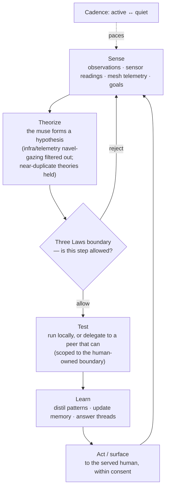

# The cognitive cycle

The familiar's autonomous loop — how it turns what it senses into theories, tests them,
and learns, always inside the boundary the human owns. It never widens its own reach; the
Three Laws are lexicographic gates, checked every tick and never mutated.

Related: [ADR-0011](../decision-records/0011-scenario-engine.md) (the reasoning +
learning machinery), the capability boundary (`crates/kernel/src/boundary.rs`), the muse
(`crates/cycle`).

## Primitives

| Primitive | What it is |
|---|---|
| **The muse** | Forms theories from what the node can see. Infrastructure telemetry (can-reach / sees / reports) is kept out of musings, and near-duplicate theories are held, so it explores the world instead of narrating its own plumbing. |
| **The boundary as a gate** | Every step is checked against the human-owned capability boundary; an agentic sub-task runs under the *intersection* of its scope and that boundary — it can never widen reach. |
| **Three Laws, lexicographic** | Boundary violations are rejected outright and the policy is never mutated — the gate is behavioural and per-cycle, not a one-time check. |
| **Delegate what you can't test** | A node that can't execute locally offers its theory to a peer that can, over gossip; the executor tests and reports back. |
| **Learning** | Confirmed regularities become distilled patterns (shareable); answered threads and outcomes feed memory. |
| **Adaptive cadence** | The loop speeds up when there's activity and rests when quiet, never faster than the human-set floor. |

Inputs come from [Observation ingest](observation-ingest.md) and
[Gossip & federation](gossip-federation.md); what it learns flows back out through the
same gossip channel.
