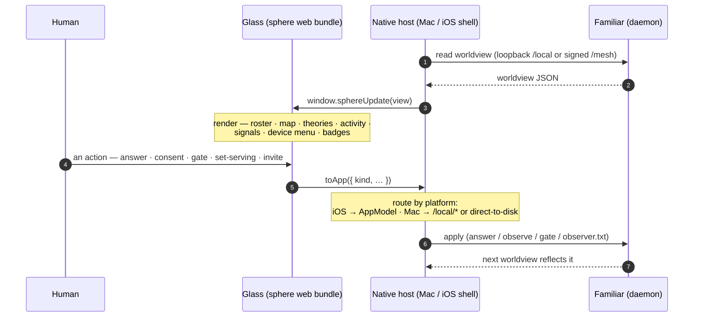

# The console (Glass)

How the human-facing surface — the Metal Sphere console on macOS, the same web bundle on
iPhone/iPad — renders the mesh and sends the human's intent back. One shared web bundle
runs everywhere; a thin native host does the I/O.

Related: [ADR-0008](../decision-records/0008-metal-sphere-web-console.md) (the sphere),
`ios/MacApp/Resources/sphere/`, [Worldview read](worldview-read.md).

## Primitives

| Primitive | What it is |
|---|---|
| **One bundle, many shells** | The same `sphere/index.html` renders on macOS and iOS; only the host differs — a WKWebView doing daemon I/O. Fix the console once, every platform gets it. |
| **Read one way, act another** | Rendering is a worldview *read*; actions travel back over a small bridge (`toApp`) to the host, which applies them at the daemon. |
| **Platform-appropriate writes** | On iOS an action calls into the app model; on the Mac the host writes the daemon's own files directly (the same trust class as the human editing them) or posts to a loopback endpoint. |
| **Wordless where it can be** | Controls are glyphs; the console leans on the sphere, the map, and badges so state reads at a glance rather than as text. |
| **Boundary stays local** | Gate writes are a human act *at the machine* — a device console never flips another node's boundary; it only shows it. |

The actions it sends land in [Observation ingest](observation-ingest.md) (answers,
consent), [The capability boundary](capability-boundary.md) (gates), and
[Served identity & attribution](served-identity.md) (who's serving).
