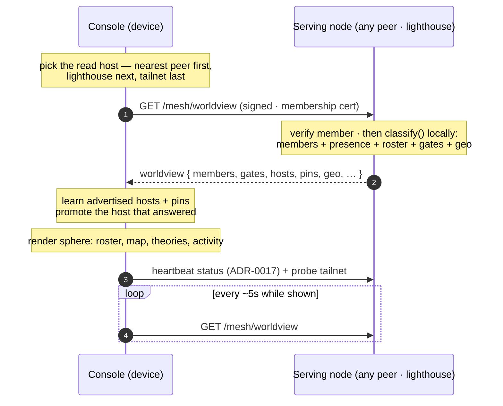

# Worldview read

How a client — the iPhone/iPad console, the Mac's sphere — reads the mesh's live state
to render its roster, map, and screens. A peer *reads* a snapshot; it never touches the
familiar's data directory.

Related: [ADR-0009](../decision-records/0009-sovereign-mesh-transport.md) (the read
seam), [Authentication & mesh membership](auth-and-membership.md) (how the read is
authorized).

## Primitives

| Primitive | What it is |
|---|---|
| **`classify()`** | The serving node builds the roster on the fly from its own store: peers + device reports → members, with presence, connectivity, attachments, dedup. Never a stored blob. |
| **Advertised hosts + pins** | The response carries where members are reachable and which certs to trust, so a client learns failover paths and off-network routes without re-enrolling. |
| **Host promotion / failover** | Whichever candidate answers becomes the standing preference; a failed read rotates to the next — the basis for Tailscale switch/fallback. |
| **Read-only** | The worldview is a *snapshot the node chose to publish*. A console reading it can never see the data dir, the group key, or another node's private state. |
| **Loopback twin** | On a machine that runs the daemon, the same view is served over loopback (`/local/worldview`). Note the **macOS app no longer uses this** — it is a peer that reads over the mesh like any other ([ADR-0018](../decision-records/0018-lighthouse-single-fixture.md)). |

The read host preference (nearest peer → lighthouse → tailnet) reads local when possible and
keeps that peer's roster fresh; see [Status & connectivity](status-connectivity.md). Preference
is about latency, not authority — a peer being nearby earns it no standing
([ADR-0018](../decision-records/0018-lighthouse-single-fixture.md)).
